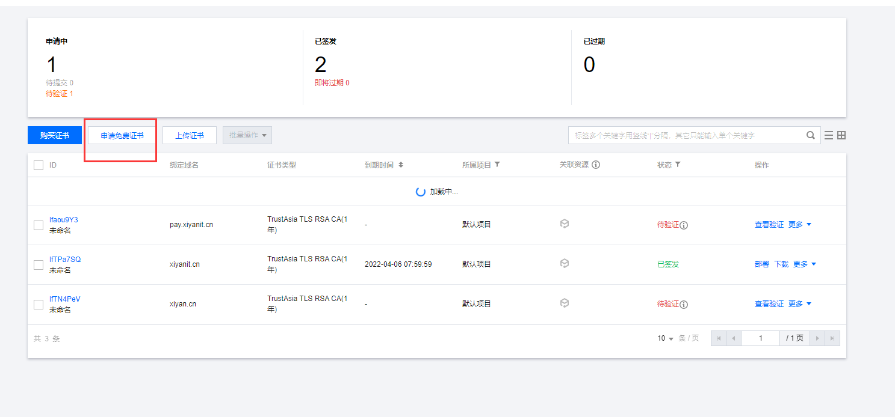
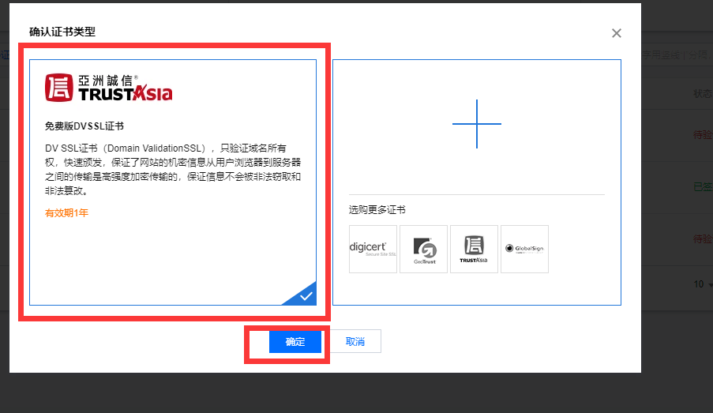
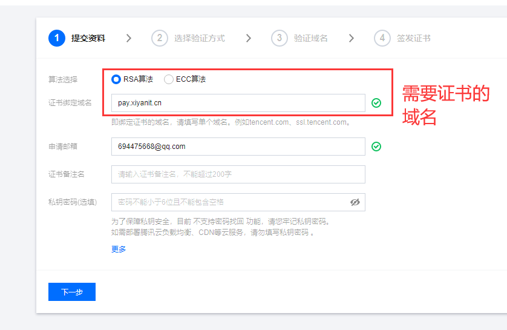
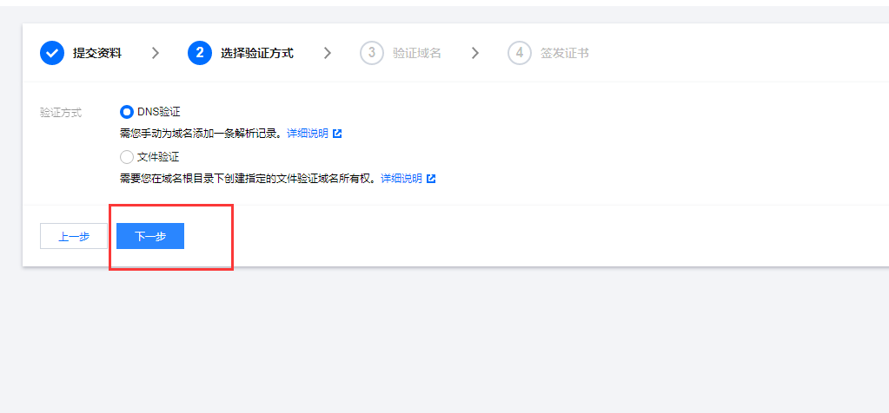
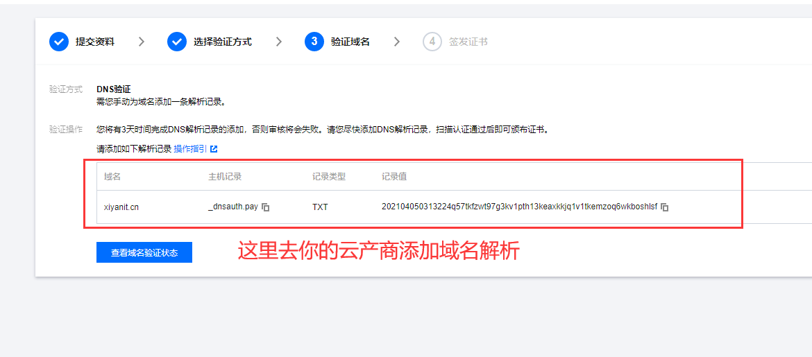
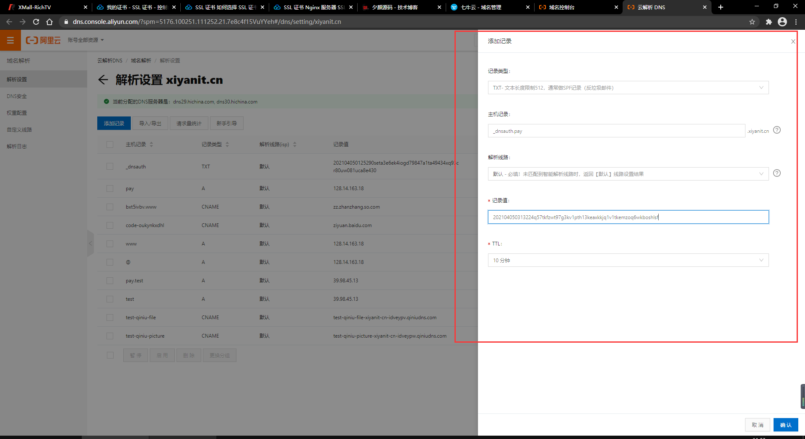
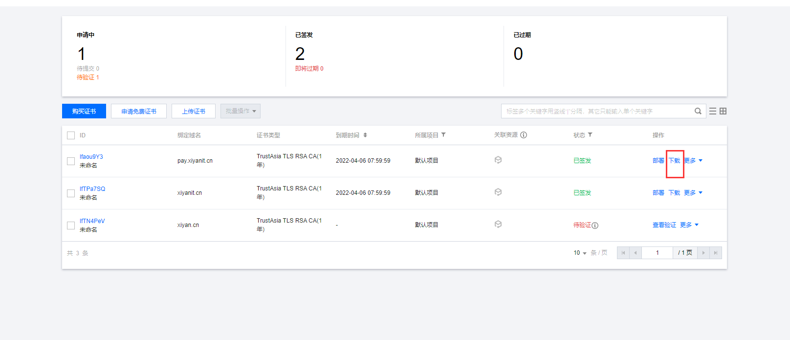

# 博主本着免费的心态开始将Http升级为Https <br>
#### 免费证书云产品有腾讯云，百度云,七牛云，博主这里选择腾讯云

### https://console.cloud.tencent.com/ssl









#### 将密钥文件上传到你的linux服务目录下

## 部署方式，我这里选择nginx部署

### https://cloud.tencent.com/document/product/400/4143

## nginx配置文档

### https://cloud.tencent.com/document/product/400/35244

#### 我夕颜博客的配置文件如下,具体请查阅官方文档
```
server {
    listen 443 ssl;
    server_name xiyanit.cn www.xiyanit.cn;
    #证书文件名称
    ssl_certificate /etc/nginx/car/1_xiyanit.cn_bundle.crt; 
 #私钥文件名称
    ssl_certificate_key /etc/nginx/car/2_xiyanit.cn.key; 
    ssl_session_timeout 5m;
 #请按照以下协议配置
    ssl_protocols TLSv1 TLSv1.1 TLSv1.2; 
 #请按照以下套件配置，配置加密套件，写法遵循 openssl 标准。
    ssl_ciphers ECDHE-RSA-AES128-GCM-SHA256:HIGH:!aNULL:!MD5:!RC4:!DHE; 
    ssl_prefer_server_ciphers on;    


    location / {
        root /enote/blog/dist/;
        index index.html;
        try_files $uri $uri /index.html;
    }
    location  /xiyan/ {
        proxy_pass http://127.0.0.1:9081/;
    }
   }
server {
    listen 443 ssl;
    server_name pay.xiyanit.cn www.pay.xiyanit.cn;
    #证书文件名称
    ssl_certificate /etc/nginx/car/1_pay.xiyanit.cn_bundle.crt;
 #私钥文件名称
    ssl_certificate_key /etc/nginx/car/2_pay.xiyanit.cn.key;
    ssl_session_timeout 5m;
 #请按照以下协议配置
    ssl_protocols TLSv1 TLSv1.1 TLSv1.2;
 #请按照以下套件配置，配置加密套件，写法遵循 openssl 标准。
    ssl_ciphers ECDHE-RSA-AES128-GCM-SHA256:HIGH:!aNULL:!MD5:!RC4:!DHE;
    ssl_prefer_server_ciphers on;

    location  / {
        proxy_pass http://127.0.0.1:6690/;
    }
   }
server {
    listen 80;
    server_name pay.xiyanit.cn www.pay.xiyanit.cn;
    return 301 https://$host$request_uri;
   }
server {
    listen 80;
    server_name xiyanit.cn www.xiyanit.cn;
    return 301 https://$host$request_uri; 
   }

```

