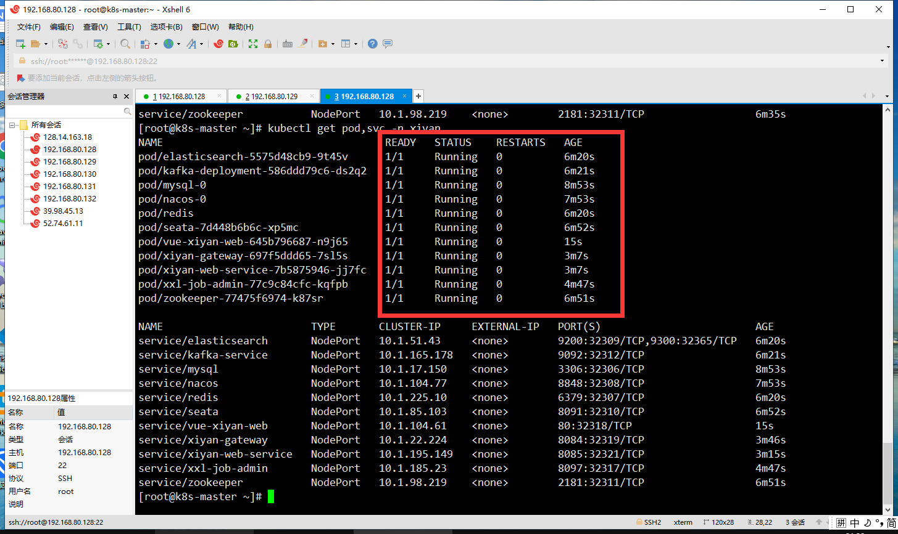

#  `K8S 一键部署`
<br>
<br>

# 1.下载源码然后将里面的k8s配置文件拷贝到你所有的服务器

Gitee地址：https://gitee.com/bright-boy/xiyan-blog/tree/master/doc/k8s

Github地址：https://github.com/694475668/xiyan-blog/tree/master/doc/k8s


---
# 2.环境（根据你自己的服务器来选，一个master，一个node也可以，我这里三台服务器）
```
k8s1 192.168.80.130
k8s2  192.168.80.131
k8s3  192.168.80.132

```
---
# 3.下载的k8s配置文件详解


+ bin：相关一键启动脚本的目录

   * completeStartup.sh：完整版启动脚本

   * completeShutdown.sh：完整版关闭脚本

   * kernStartup.sh：核心版启动脚本【只包含必要的组件】

   * kernShutdown.sh：核心版关闭脚本

   * update.sh：用于更新镜像【同步最新代码时使用】

* config：存放配置文件

* data：存放数据文件

* k8s-install：一键部署K8S集群脚本

* k8s-upgrade：一键升级K8S集群脚本（可选）

* k8s-addNode：一键扩容K8S集群脚本（可选）

* yaml 各组件yaml文件

---
# 4.修改所有集群服务器的hostname
192.168.80.130

`hostnamectl set-hostname k8s1`

192.168.80.131

`hostnamectl set-hostname k8s2`

192.168.80.132

`hostnamectl set-hostname k8s3`

---
# 5.修改hosts（所有节点）


使用键盘工具可以同时在一个节点上修改所有节点的配置

`vi /etc/hosts`

```
192.168.80.130      k8s1
192.168.80.131      k8s2
192.168.80.132      k8s3
```


---
# 6.将下载的k8s文件`上传到所有的集群服务器`


授权完成后可以关闭键盘工具

```
chmod -R 777 k8s/
```

# 7.修改域名


# 8.`master`执行脚本文件（务必关闭键盘工具）
## 8.1修改配置文件


## 8.2执行脚本
```
cd k8s/bin/

./kernStartup.sh

```


## 8.3执行成功查看节点是否正常

```
kubectl get pod,svc -n xiyan
```



# 9.支付配置
打开支付网页，刚刚你在nginx配置的域名   账户密码admin


---
# 10.修改nacos配置
打开http://ip8848/nacos  默认账户密码nacos


---
# 11.重启xiyan-web-service服务

## 11.1 停止服务
```
kubectl delete -f xiyan-web-service.yaml
```
## 11.2 启动服务

```
kubectl apply -f xiyan-web-service.yaml
```

---
# 12.访问
用你刚刚配置的域名进行访问


---
# 13.如果没有运行成功，欢迎进群进行指导你
