# Linux 部署
<br>
<br>

# `1. Docker安装`

### 前言：作者采用的是CentOS7系统

`docker介绍：Docker 是一个开源的商业产品，有两个版本：社区版（Community Edition，缩写为 CE）和企业版（Enterprise Edition，缩写为 EE）。企业版包含了一些收费服务，个人开发者一般用不到`

### 为什么我需要安装docker

##### 因为docker可以简化安装部署

Docker 要求 CentOS 系统的内核版本在 3.10以上 ，查看本页面的前提条件来验证你的CentOS 版本是否支持 Docker 。
   + ### 1、 通过 uname -r 命令查看你当前的内核版本

    `uname -r`   

   + ### 2、 使用 root 权限登录 Centos。确保 yum 包更新到最新。
    `yum -y update`

   + ### 3、卸载旧版本(如果安装过旧版本的话)
    `yum remove docker docker-common docker-selinux docker-engine`

   + ### 4、安装需要的软件包， yum-util 提供yum-config-manager功能，另外两个是devicemapper驱动依赖的
     `yum install -y yum-utils device-mapper-persistent-data lvm2`

   + ### 5、设置yum源
     `yum-config-manager --add-repo https://download.docker.com/linux/centos/docker-ce.repo`

   + ### 6、可以查看所有仓库中所有docker版本，并选择特定版本安装
     `yum list docker-ce --showduplicates | sort -r`

   + ### 7、安装docker
     `sudo yum install -y docker-ce`     # 由于repo中默认只开启stable仓库，故这里安装的是最新稳定版

   + ### 8、启动并加入开机启动

      ```
      systemctl start docker
      systemctl enable docker
      ```

   + ### 9、验证安装是否成功(有client和service两部分表示docker安装启动都成功了)
     `docker version`

     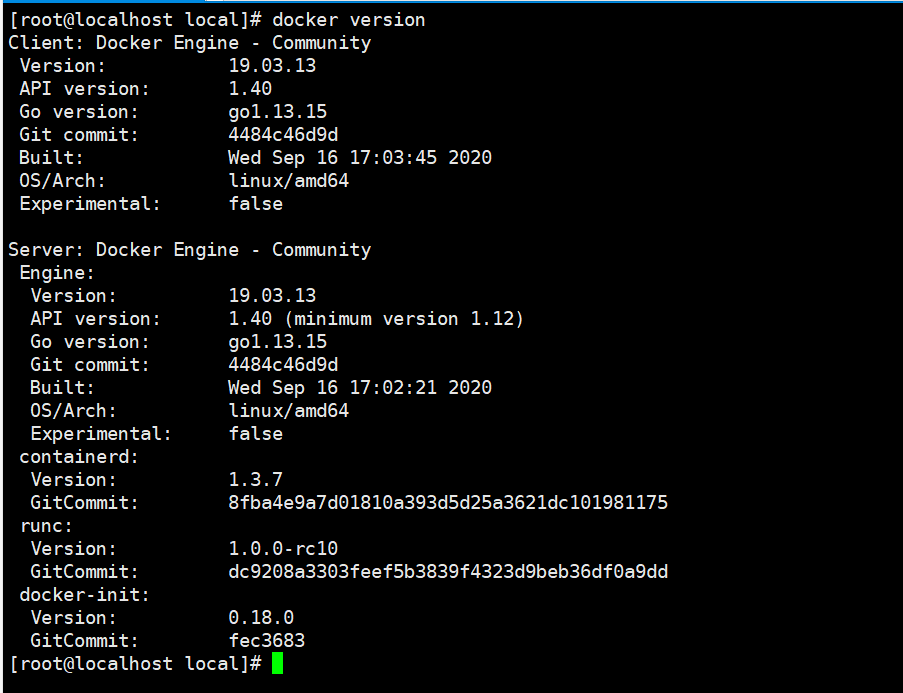

   + ### 10.安装图形页面管理Portainer
     `docker run -d -p 9000:9000 -v /var/run/docker.sock:/var/run/docker.sock -v portainer_data:/data portainer/portainer`
     
   + ### 11.访问方式：http://IP:9000 ，首次登录需要注册用户，给用户admin设置密码，如下图：
     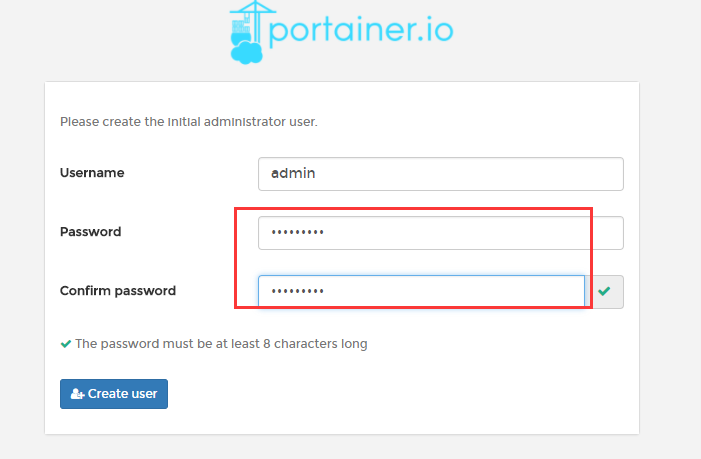
     ##### 单机版本选择“Local"，点击Connect即可连接到本地docker，如下图：
     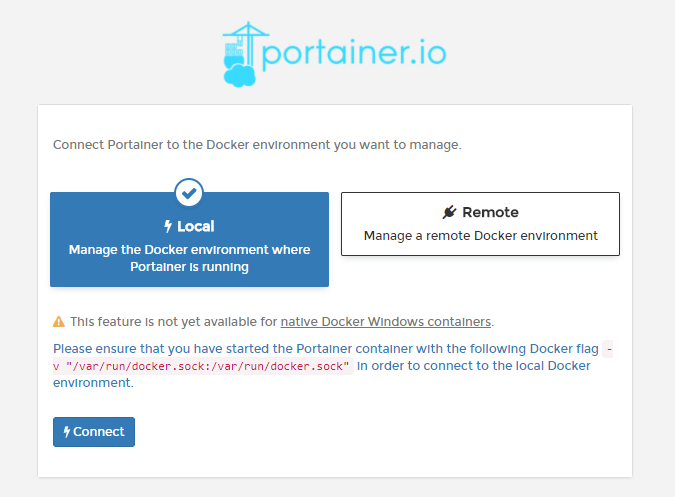
     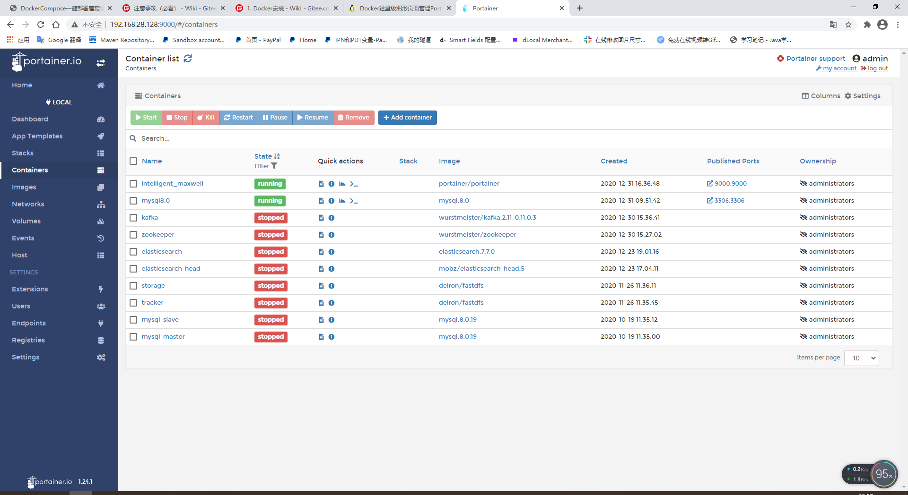


---
# `2. Mysql安装`
### 这里我是采用Docker安装Mysql
+ ### 1.启动并拉取镜像
`docker run -p 3306:3306 --name mysql8.0 -e MYSQL_ROOT_PASSWORD=root -d mysql:8.0`

   1. -p 将本地主机的端口映射到docker容器端口
   2. --name 容器名称命名
   3. -e 配置信息，配置root密码
   4. -d 镜像名称

+ ### 2.进入docker容器
 `docker exec -it mysql8.0 bash`

+ ### 3.登录mysql
`mysql -uroot -p`

+ ### 4.修改配置使外部能够访问

`alter user 'root'@'%' identified with mysql_native_password by 'root';`

+ ### 5.测试Navicat进行连接数据

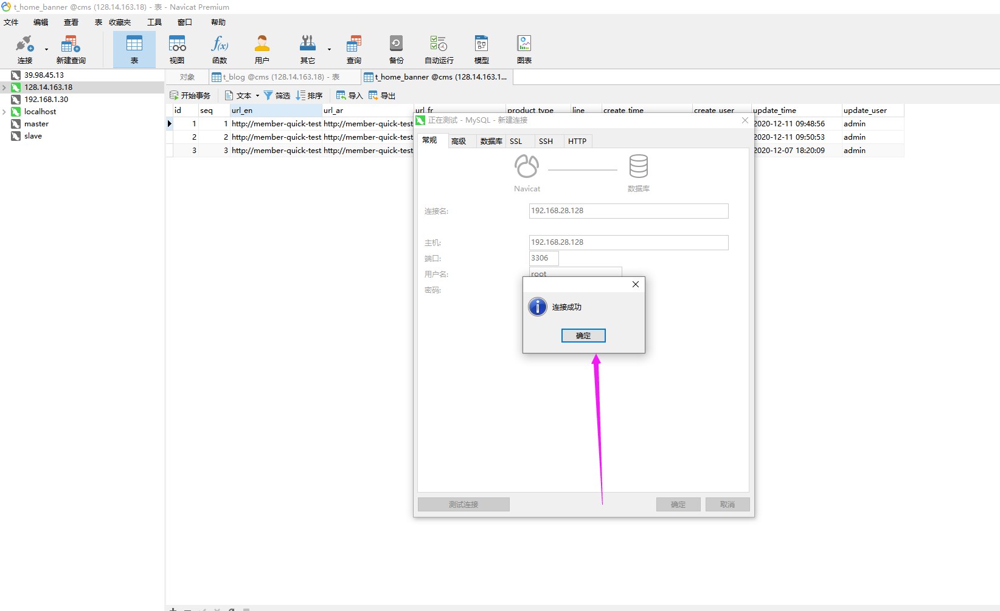

 `这样你的mysql就安装成功了`

+ ### 6.导入Mysql文件到数据库

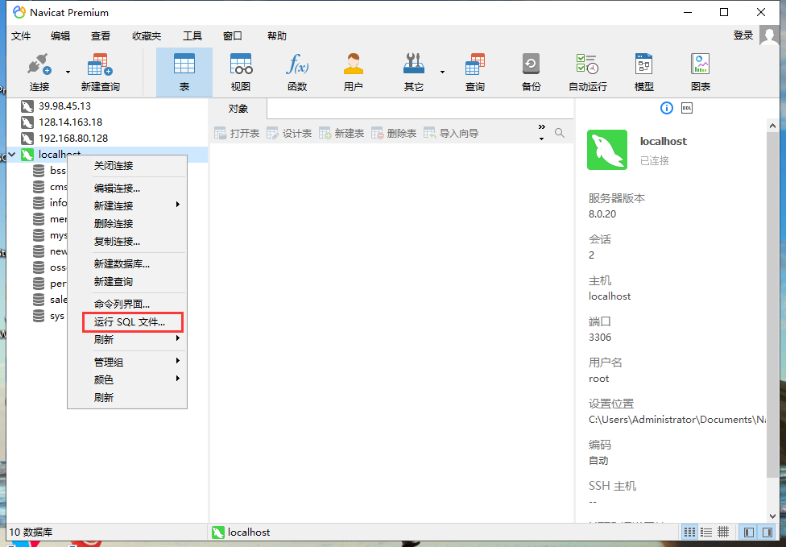

把所有的sql文件进行导入进来

---

# `3. Redis安装`
### 这里我没有采用Docker安装Redis，有兴趣的可以采用Docker进行安装

+ ### 一、安装gcc依赖


由于 redis 是用 C 语言开发，安装之前必先确认是否安装 gcc 环境（gcc -v），如果没有安装，执行以下命令进行安装

`
yum install -y gcc
`

+ ### 二、下载并解压安装包


```
wget http://download.redis.io/releases/redis-5.0.3.tar.gz

tar -zxvf redis-5.0.3.tar.gz
```
+ ### 三、cd切换到redis解压目录下，执行编译


```
cd redis-5.0.3

make

```

 

+ ### 四、安装并指定安装目录


`make install PREFIX=/usr/local/redis`

`cd /usr/local/redis/bin/`


+ ### 五、后台启动


从 redis 的源码目录中复制 redis.conf 到 redis 的安装目录

`cp /usr/local/redis-5.0.3/redis.conf /usr/local/redis/bin/`


+ ### 修改 redis.conf 文件，把 daemonize no 改为 daemonize yes
+ ### 修改 redis.conf 文件，把 bind 127.0.0.1 改为 bind 0.0.0.0

`vi redis.conf`


### 启动


`./redis-server redis.conf`

### RedisDesktopManager连接   
##### `下载地址======>  链接：https://pan.baidu.com/s/1gdrhkOpTEredaGfQckGrwQ，密码:9jyf`

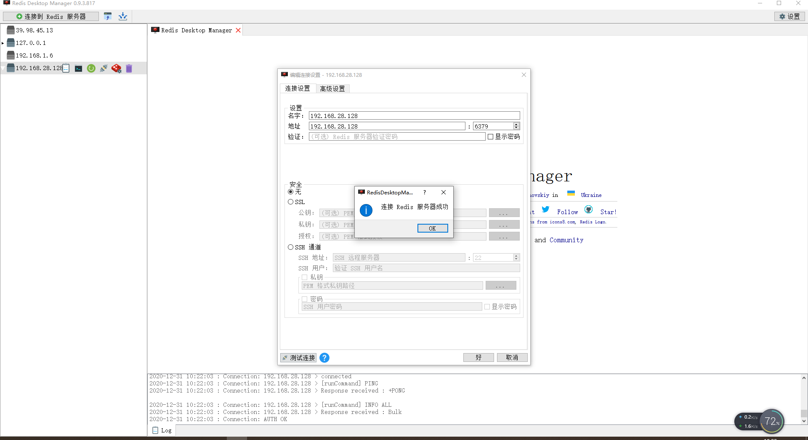

+ ### 六、设置开机启动


+ ###  6.1添加开机启动服务


`vi /etc/systemd/system/redis.service`

复制粘贴以下内容：


```
[Unit]
Description=redis-server
After=network.target

[Service]
Type=forking
ExecStart=/usr/local/redis/bin/redis-server /usr/local/redis/bin/redis.conf
PrivateTmp=true

[Install]
WantedBy=multi-user.target
```


#### 复制代码
#### 注意：ExecStart配置成自己的路径 


 

### 6.2设置开机启动


```
systemctl daemon-reload

systemctl start redis.service

systemctl enable redis.service
```


 

### 6.3创建 redis 命令软链接


ln -s /usr/local/redis/bin/redis-cli /usr/bin/redis

`

### 6.4 测试 redis

### 6.5服务操作命令


```
systemctl start redis.service   #启动redis服务

systemctl stop redis.service   #停止redis服务

systemctl restart redis.service   #重新启动服务

systemctl status redis.service   #查看服务当前状态

systemctl enable redis.service   #设置开机自启动

systemctl disable redis.service   #停止开机自启动
```
---
# `4. Elasticsearch安装`
### 1.设置max_map_count不能启动es会启动不起来

查看max_map_count的值 默认是65530

`cat /proc/sys/vm/max_map_count`

### 重新设置max_map_count的值


`sysctl -w vm.max_map_count=262144`

### 2.下载镜像并运行


```
#拉取镜像
docker pull elasticsearch:7.7.0


#启动镜像
docker run --name elasticsearch -d -e ES_JAVA_OPTS="-Xms512m -Xmx512m" -e "discovery.type=single-node" -p 9200:9200 -p 9300:9300 elasticsearch:7.7.0
```
参数说明

```
--name表示镜像启动后的容器名称  

-d: 后台运行容器，并返回容器ID；

-e: 指定容器内的环境变量

-p: 指定端口映射，格式为：主机(宿主)端口:容器端口
```

### 3.浏览器访问ip:9200 如果出现以下界面就是安装成功

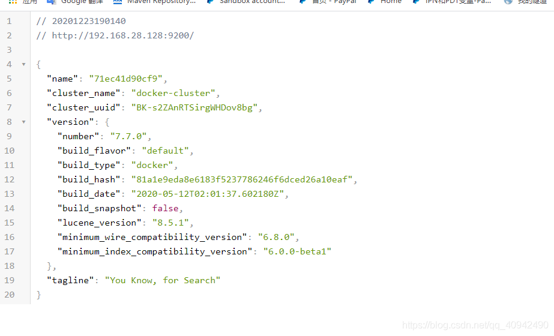
### 4.安装elasticsearch-head  (可选)


```
#拉取镜像
docker pull mobz/elasticsearch-head:5


#创建容器
docker create --name elasticsearch-head -p 9100:9100 mobz/elasticsearch-head:5

#启动容器
docker start elasticsearch-head
or
docker start 容器id （docker ps -a 查看容器id ）
```
5.浏览器打开: http://IP:9100
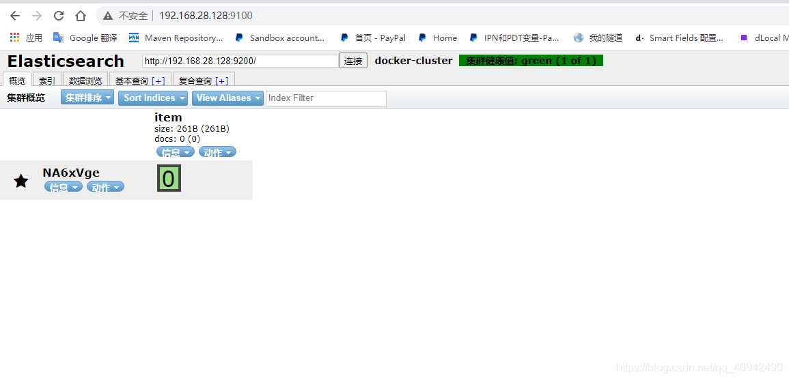

### 尝试连接easticsearch会发现无法连接上，由于是前后端分离开发，所以会存在跨域问题，需要在服务端做CORS的配置。
### 解决办法

### 6.修改docker中elasticsearch的elasticsearch.yml文件


```
docker exec -it elasticsearch /bin/bash （进不去使用容器id进入）

vi config/elasticsearch.yml
```
在最下面添加2行


```
http.cors.enabled: true 
http.cors.allow-origin: "*"
```
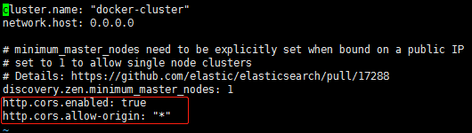

退出并重启服务


```
exit
docker restart 容器id
```


### 7.ElasticSearch-head 操作时不修改配置，默认会报 406错误码


```
#复制vendor.js到外部
docker cp fa85a4c478bf:/usr/src/app/_site/vendor.js /usr/local/

#修改vendor.js
vim vendor.js
```
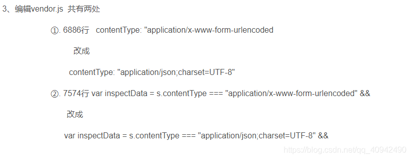

##### 修改完成在复制回容器

`docker cp /usr/local/vendor.js  fa85a4c478bf:/usr/src/app/_site`

##### 重启elasticsearch-head

`docker restart 容器id`

最后就可以查询到es数据了
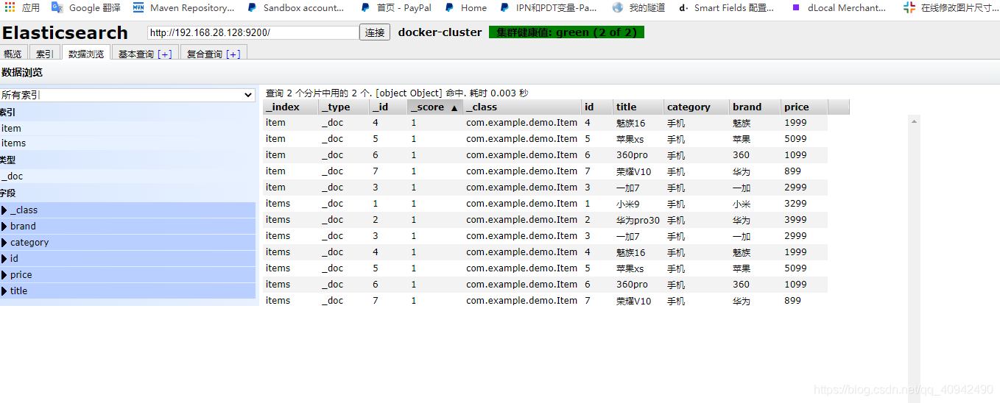

### 8.安装ik分词器 （给大家个建议，这玩意装与不装都挺好，不装查到的东西也很精确够使，装上会查出一些没有用的！）

这里采用离线安装

下载分词器压缩包
下载地址：

https://github.com/medcl/elasticsearch-analysis-ik/releases/download/v7.7.0/elasticsearch-analysis-ik-7.7.0.zip
将IK分词器上传到/tmp目录中（xftp）

将分词器安装进容器中


```
#将压缩包移动到容器中
docker cp /tmp/elasticsearch-analysis-ik-7.7.0.zip elasticsearch:/usr/share/elasticsearch/plugins

#进入容器
docker exec -it elasticsearch /bin/bash  

#创建目录
mkdir /usr/share/elasticsearch/plugins/ik

#将文件压缩包移动到ik中
mv /usr/share/elasticsearch/plugins/elasticsearch-analysis-ik-7.7.0.zip /usr/share/elasticsearch/plugins/ik

#进入目录
cd /usr/share/elasticsearch/plugins/ik

#解压
unzip elasticsearch-analysis-ik-7.7.0.zip

#删除压缩包
rm -rf elasticsearch-analysis-ik-7.7.0.zip
```
退出并重启镜像

---

# `5. Kafka安装`
### 1.安装zookeeper
`docker run -d --name zookeeper -p 2181:2181 -v /etc/localtime:/etc/localtime wurstmeister/zookeeper`

### 2.安装kafka
`docker run  -d --name kafka -p 9092:9092 -e KAFKA_BROKER_ID=0 -e KAFKA_ZOOKEEPER_CONNECT=10.9.44.11:2181 -e KAFKA_ADVERTISED_LISTENERS=PLAINTEXT://10.9.44.11:9092 -e KAFKA_LISTENERS=PLAINTEXT://0.0.0.0:9092 -t wurstmeister/kafka`

---
# `6. Nacos安装`
### 一、快速开始：启动nacos服务（单机模式）

### 1. 下载源码或者安装包

#### 安装包地址：https://github.com/alibaba/nacos/releases

### 2. 通过xhell上传到/usr/local（目前可以自己定）目录下
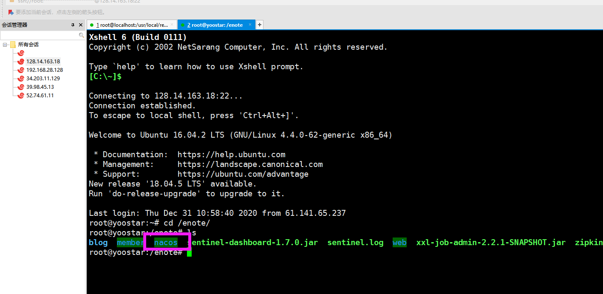

### 3. 解压
`tar -zxvf nacos项目名称`

### 4. 输入命令启动服务
`cd nacos/bin`

### 5.（单机模式）启动

```
linux：sh startup.sh -m standalone

windows：cmd startup.cmd
```

### nacos默认使用8848端口，可通过http://ip:8848/nacos 进入自带的控制台界面，默认用户名/密码是nacos/nacos
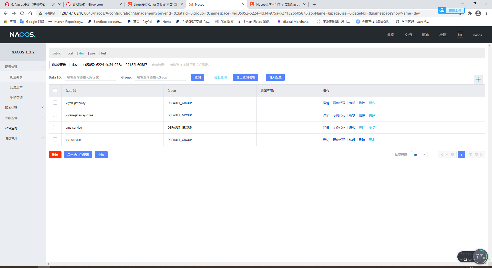

### 6.将配置写入到nacos中
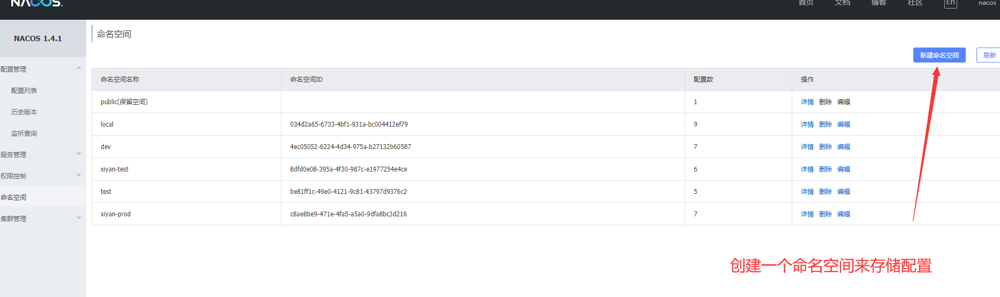
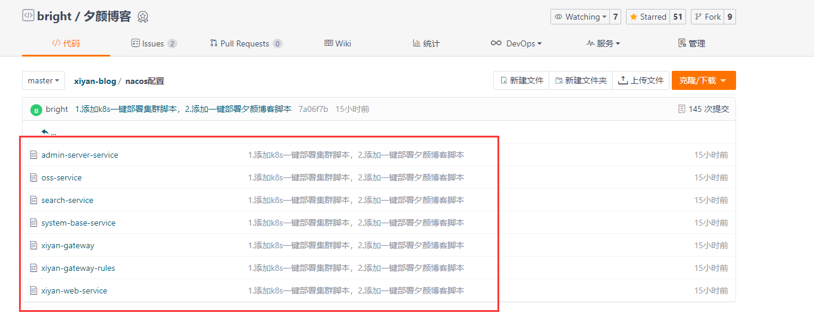
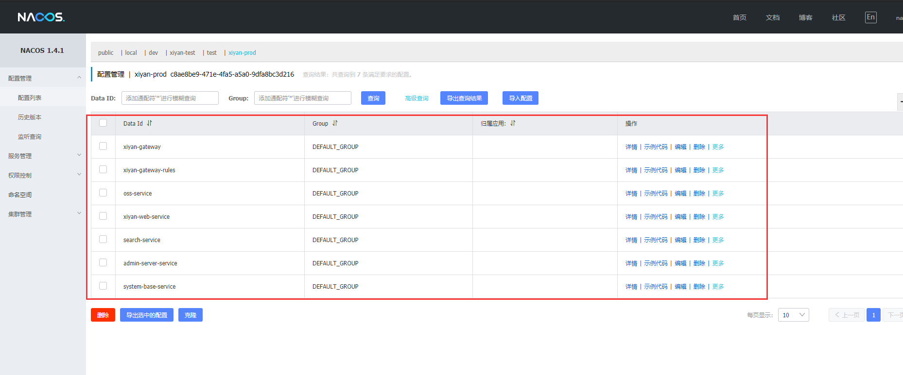

### 7.修改所有的配置,将ip改为你自己服务器IP

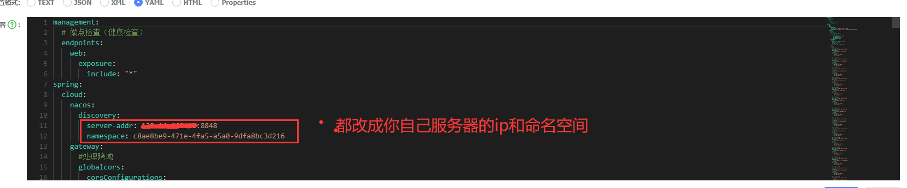

---
# `7. Zipkin安装(可选)`
###  1.下载

### https://dl.bintray.com/openzipkin/maven/io/zipkin/java/zipkin-server/
### 2. 下载好了上传到linux服务器
### 3.运行
### 3.1没有分布式日志收集运行方式

`nohup java -jar -Xms64m -Xmx128m zipkin-server-2.12.9-exec.jar > zipkin.log  2>&1 &`
### 3.2有分布式日志运行方式（请更换对应的服务器ip）

`nohup java -jar -Xms64m -Xmx128m zipkin-server-2.19.0-exec.jar --KAFKA_BOOTSTRAP_SERVERS=10.20.22.30:9092 --STORAGE_TYPE=elasticsearch --ES_HOSTS=http://10.20.22.30:9200 >output 2>&1 &`
### 4.访问 http://ip:9411/zipkin/ 即可查看zipkin

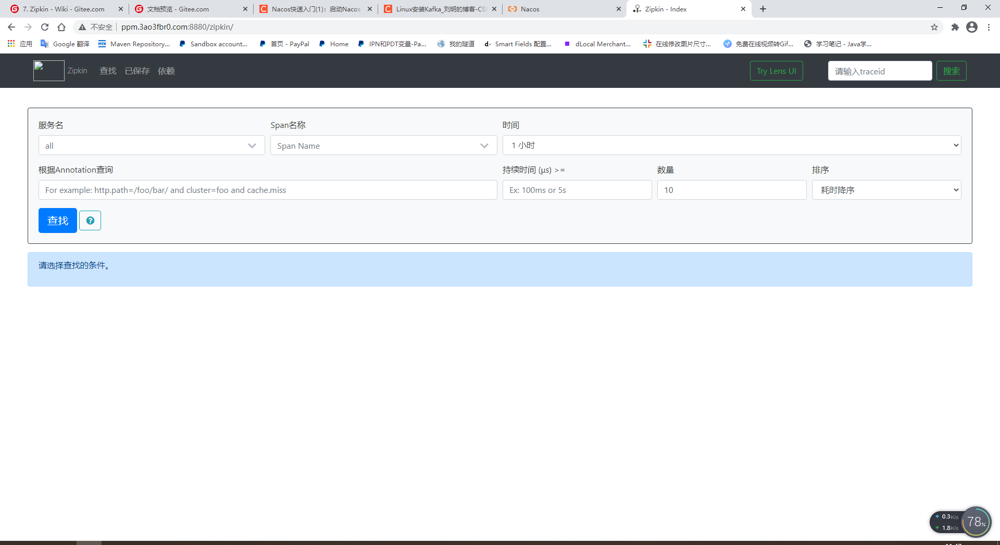

---
# `8. Sentinel安装(可选)`
### 1.下载地址

### https://github.com/alibaba/Sentinel/releases
### 2.上传到linux服务器
### 3.运行
`nohup java -jar -Xms64m -Xmx128m sentinel-dashboard-1.8.0.jar --server.port=8888 > sentinel.log  2>&1 &`
### 4.访问http://ip:8888/ 默认账户密码是sentinel
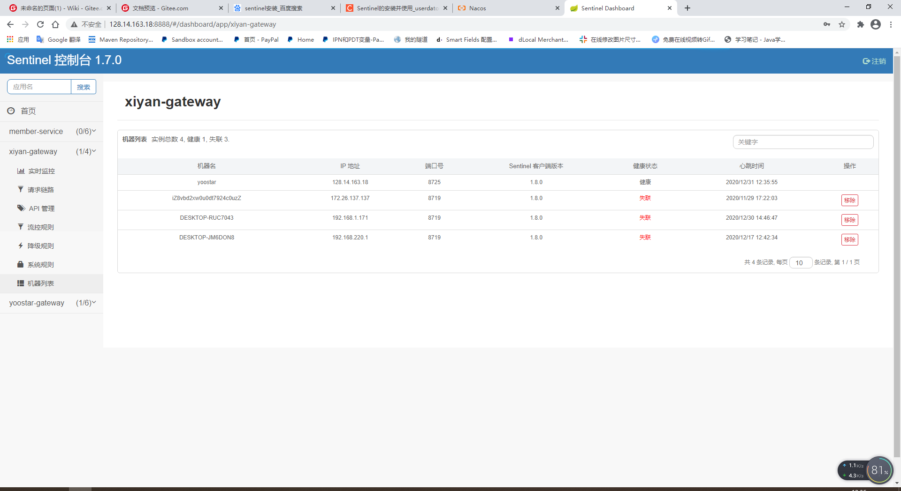
# `9. Seata安装`
### 1.下载

`wget https://github.com/seata/seata/releases/download/v1.3.0/seata-server-1.3.0.tar.gz`

### 2.解压

`tar -zxvf seata-server-1.3.0.tar.gz`
### 3.修改registry.conf配置
`cd seata/conf`
```
vim registry.conf
```
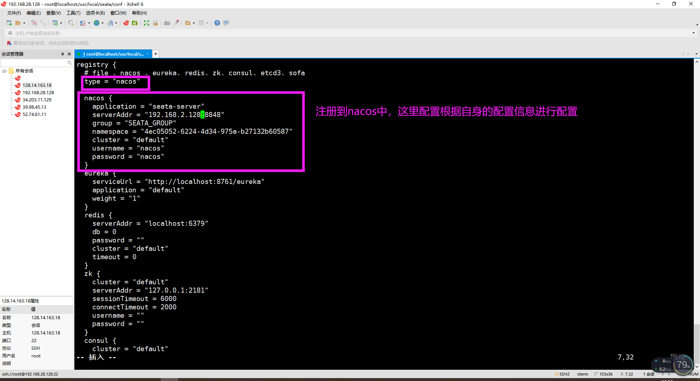
### 4.修改file.conf配置
```
vim file.conf
```
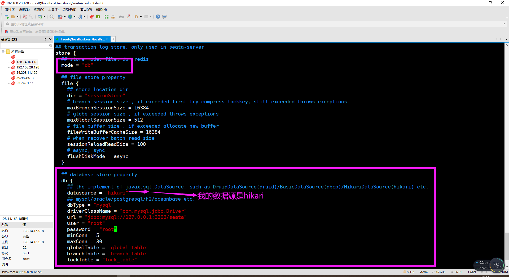
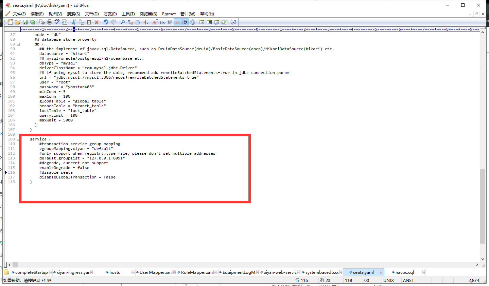
```
service{
vgroupMapping.xiyan="default"
grouplist.default="192.168.28.128:8091"
}
```

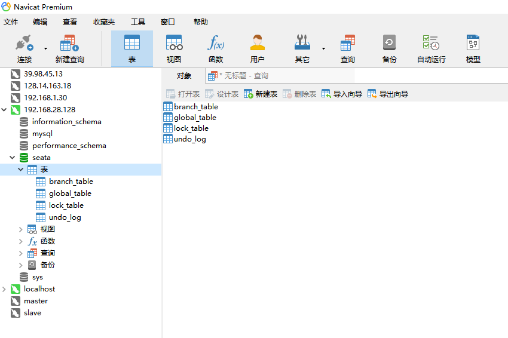

### 6.启动seata

```
#编写脚本 （目录/usr/local/seata）
vim seatastart.sh
```

```
# 内容
nohup  ./bin/seata-server.sh -p 8091 -h 192.168.28.128 -m file  >nohup.out 2>1 &
```

```
# 授权
chmod -R 777 seatastart.sh
```

```
#启动
./seatastart.sh
```
### 7.查看seata是否注册到nacos
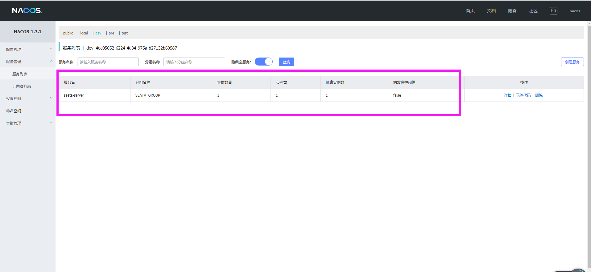

---
# `10. xxl-job部署`
### 1.打开项目xxl-job

### 2.修改配置
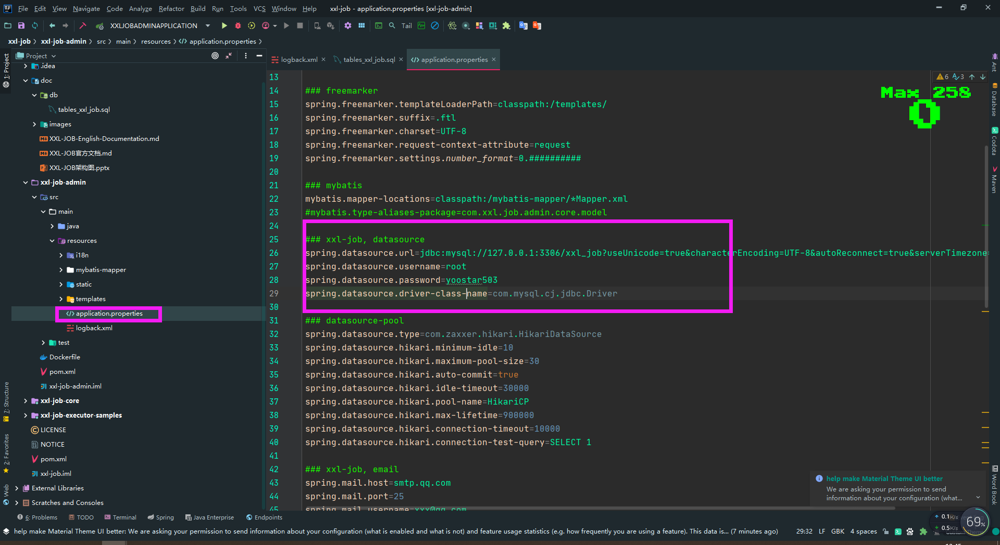
### 3.打包

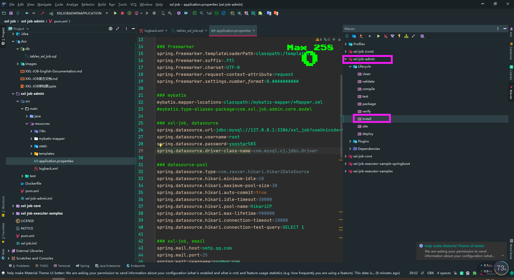
### 4.上传到服务器

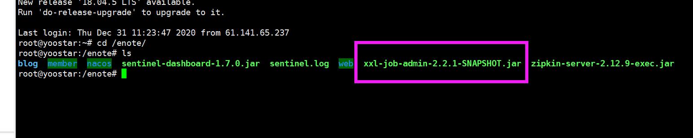
### 5.运行

`nohup java -jar -Xms64m -Xmx128m xxl-job-admin-2.2.1-SNAPSHOT.jar  > xxl-job.log  2>&1 &`
### 6.访问 http://ip:8088/xxl-job-admin/ 默认账户admin 密码123456
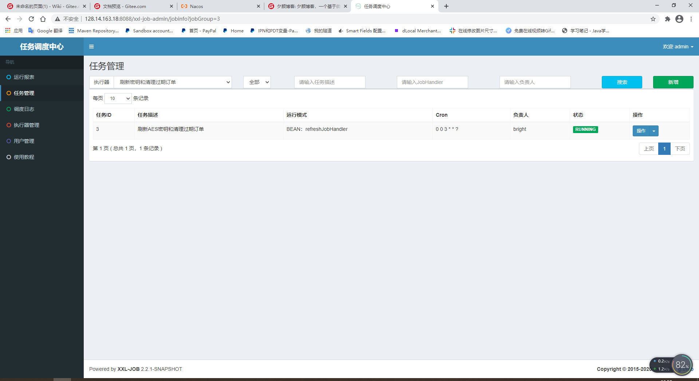

# `11. Nginx安装`
### nginx安装（linux系统）

### 一. gcc 安装

##### 安装 nginx 需要先将官网下载的源码进行编译，编译依赖 gcc 环境，如果没有 gcc 环境，则需要安装：

`yum install gcc-c++`

### 二. PCRE pcre-devel 安装

##### PCRE(Perl Compatible Regular Expressions) 是一个Perl库，包括 perl 兼容的正则表达式库。nginx 的 http 模块使用 pcre 来解析正则表达式，所以需要在 linux 上安装 pcre 库，pcre-devel 是使用 pcre 开发的一个二次开发库。nginx也需要此库。命令：

`yum install -y pcre pcre-devel`

### 三. zlib 安装

##### zlib 库提供了很多种压缩和解压缩的方式， nginx 使用 zlib 对 http 包的内容进行 gzip ，所以需要在 Centos 上安装 zlib 库。

`yum install -y zlib zlib-devel`

### 四. OpenSSL 安装

##### OpenSSL 是一个强大的安全套接字层密码库，囊括主要的密码算法、常用的密钥和证书封装管理功能及 SSL 协议，并提供丰富的应用程序供测试或其它目的使用。
##### nginx 不仅支持 http 协议，还支持 https（即在ssl协议上传输http），所以需要在 Centos 安装 OpenSSL 库。

`yum install -y openssl openssl-devel`

### 五.直接下载.tar.gz安装包，地址：https://nginx.org/en/download.html

`wget -c https://nginx.org/download/nginx-1.19.0.tar.gz`

### 六.解压

##### 依然是直接命令：

`tar -zxvf nginx-1.19.0.tar.gz`

`cd nginx-1.19.0`

### 七.配置

##### 其实在 nginx-1.19.0 版本中你就不需要去配置相关东西，默认就可以了。当然，如果你要自己配置目录也是可以的。
#### 1.使用默认配置

> ./configure

#### 2.自定义配置（不推荐）

> ./configure \
--prefix=/usr/local/nginx \
--conf-path=/usr/local/nginx/conf/nginx.conf \
--pid-path=/usr/local/nginx/conf/nginx.pid \
--lock-path=/var/lock/nginx.lock \
--error-log-path=/var/log/nginx/error.log \
--http-log-path=/var/log/nginx/access.log \
--with-http_gzip_static_module \
--http-client-body-temp-path=/var/temp/nginx/client \
--http-proxy-temp-path=/var/temp/nginx/proxy \
--http-fastcgi-temp-path=/var/temp/nginx/fastcgi \
--http-uwsgi-temp-path=/var/temp/nginx/uwsgi \
--http-scgi-temp-path=/var/temp/nginx/scgi

#### 3.编译安装
> make

> make install

### 八. `whereis nginx` 查询nginx安装的路径


### 九.进入你安装nginx目录下找到nginx.conf进行编辑 如下配置是vue静态资源加速

添加

	
```
#启用或禁用gzipping响应。
gzip on;
#启用或禁用gzipping响应。
gzip_buffers 4 16k;
#设置level响应的gzip压缩。可接受的值范围为1到9。
gzip_comp_level 5;
#置将被gzip压缩的响应的最小长度。长度仅由“Content-Length”响应头字段确定。
gzip_min_length 100;
#匹配MIME类型进行压缩，text/html默认被压缩。        
gzip_types text/plain application/javascript text/css application/xml text/javascript application/x-httpd-php image/jpeg image/gif image/png;
log_format  main  '$remote_addr - $remote_user [$time_local] "$request" '
                  '$status $body_bytes_sent "$http_referer" '
                  '"$http_user_agent" "$http_x_forwarded_for"';
#引入/usr/local/nginx/conf.d下面的所有配置文件
include /usr/local/nginx/conf.d/*.conf;
```
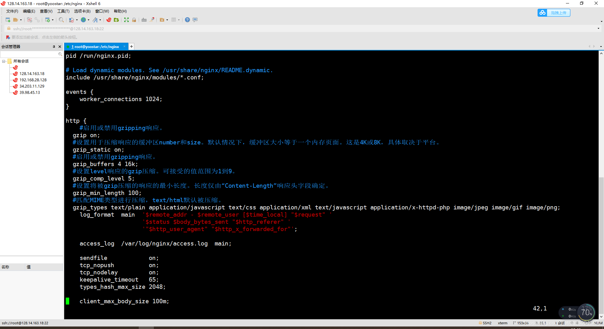

### 十:wq退出保存后创建目录名为conf.d

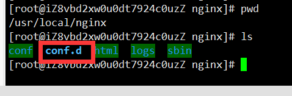

目录下就可以方自己单独的配置文件在这里插入图片描述
开始启动配置

> vim /etc/profile

##### 加入


```
PATH=$PATH:/usr/local/nginx/sbin
export PATH
```

```
source /etc/profile
```

### 十一. 启动、停止nginx

> cd /usr/local/nginx/sbin/

```
#启动
./nginx 
#停止
./nginx -s stop
#刷新
./nginx -s reload
```

网站可以访问ip+端口查询nginx是否安装成功 (如果是如下图片就算是安装成功了)


#### 解决Nginx: [error] open() ＂/usr/local/Nginx/logs/Nginx.pid 重新启动服务器，访问web服务发现无法浏览啦!登陆服务器之后进到nginx使用./nginx -s reload重新读取配置文件，发现报nginx: [error] open() "/usr/local/nginx/logs/nginx.pid" failed (2: No such file or directory)错误，进到logs文件发现的确没有nginx.pid文件


```
解决方法：
/usr/local/nginx/sbin/nginx -c /usr/local/nginx/conf/nginx.conf
```
---

# `12. elk+filebeat+kafka日志收集`(可选)
http://xiyanit.cn/article?id=21

---

# `13. Nginx前端部署`
## 我这里配置是采用http协议方式进行配置的,如果你买的是http协议的域名需要改为https方式的请移步[Http升级Https](http.md)
### 1.打开前端项目（我这里采用的前端开发工具是VSCode）
### 2.修改后端服务地址

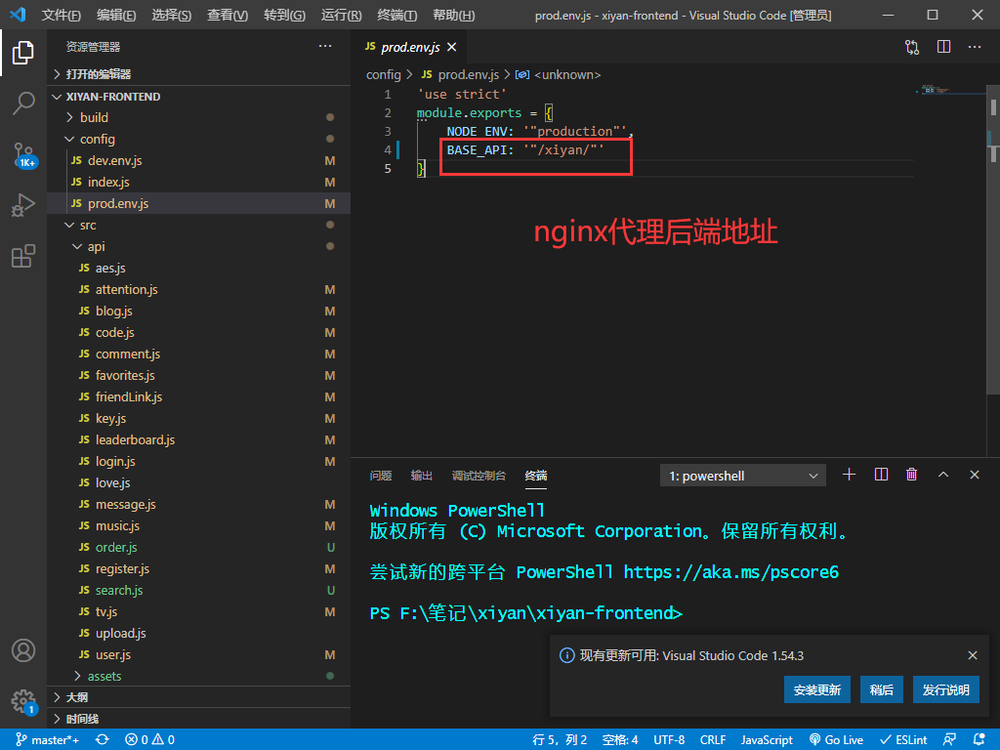
### 3.项目打包
`npm run build`

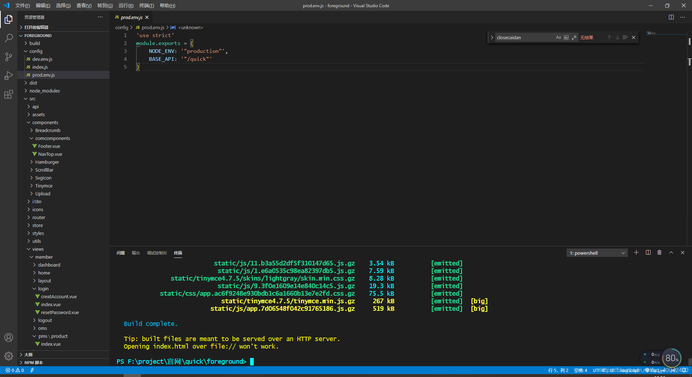
### 4.打包后会出现一个dist目录文件，请把这个上传服务器

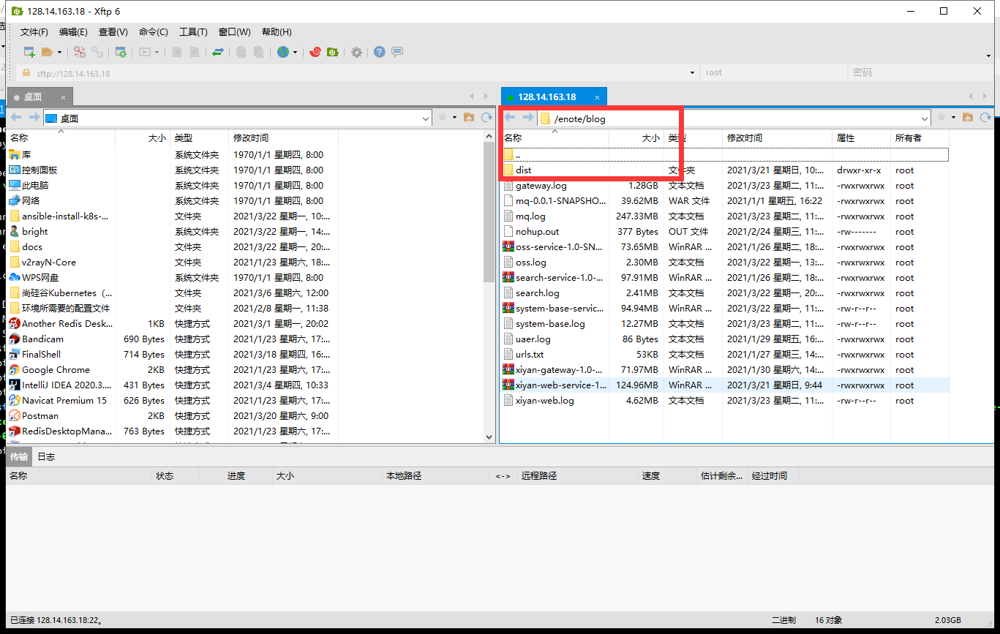
### 5. `配置xiyan.conf 你自己在上面创建conf.d目录下创建这个文件`
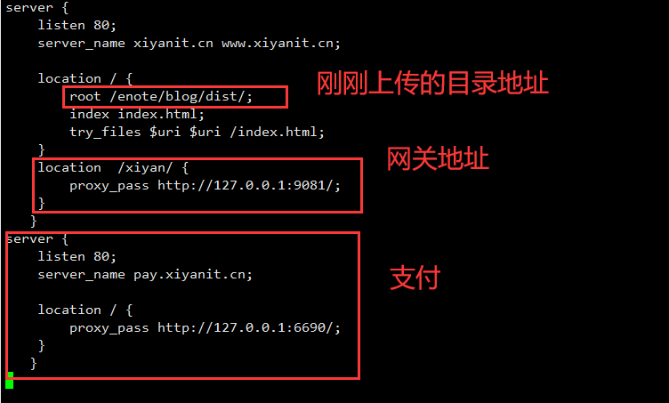

## `13.1 Nuxt前端部署到Nginx` （如果你选择是Vue版本的就不需要部署Nuxt,如果部署Nuxt就不需要部署vue的）

### 部署参考 https://xiyanit.cn/article?id=70

---
# `14. 部署后端`

### 1. 创建目录来存储jar包
```
mkdir /home/aisys/service-jar

```
### 2. 下载构建脚本文件（`上传到/home/aisys/service-jar目录下`）
链接：https://pan.baidu.com/s/1xVIEJdtSjoA9plsWLUZkbw 

提取码：1iha 


### 3. 构建并打包上传到服务器`/home/aisys/service-jar对应的服务目录下`
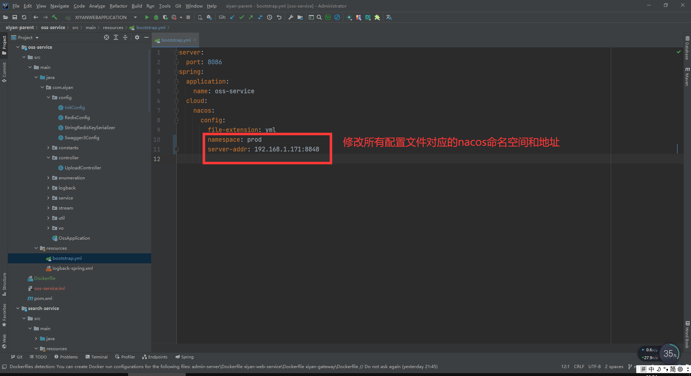
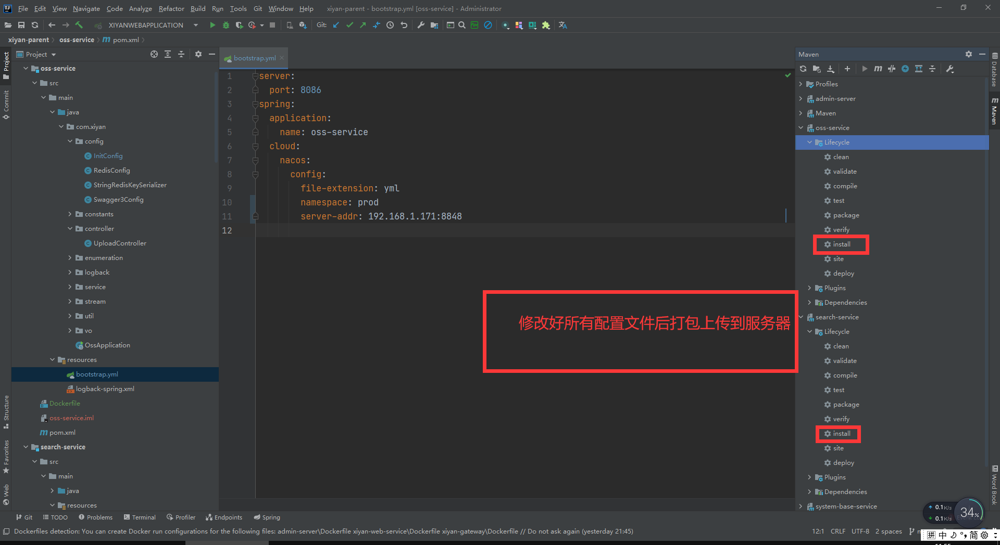

### 4. 执行脚本启动所有的后端服务
```
chmod -R 777 /home/aisys/service-jar

./start.sh  #启动

```

### 至此结束了


---
# 15.如果没有运行成功，欢迎进群进行指导你


