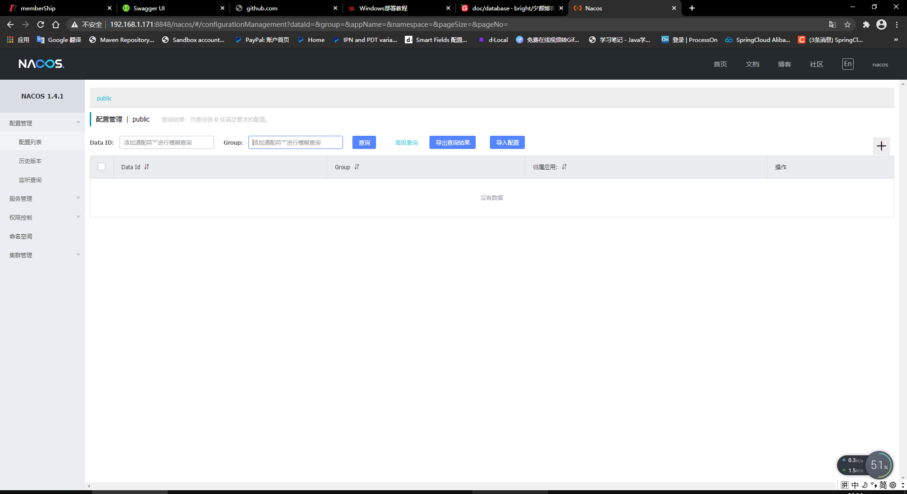

# `Windows 部署`
<br>
<br>
<br>


# `1. 下载项目源码`

Gitee地址：https://gitee.com/bright-boy/xiyan-blog

Github地址：https://github.com/694475668/xiyan-blog

---

# `2. 安装博客之前请将JDK安装，mysql数据库安装，IntelliJ IDEA安装`

### 工具下载地址：http://xiyanit.cn/tool

如安装有问题，进群咨询

##  `安装完将下载源码里面的sql导入到数据库中`


---
# `3. nacos部署`

#### nacos下载地址，直接运行就可以用，我都已经配置好了的： 

链接：https://pan.baidu.com/s/1PJ6TLQdN_uOdAEjo56BgAw 

提取码：cyu5 


## 3.1访问地址ip:8848/nacos 默认用户名密码都是nacos



---
# `4. redis部署`

链接：https://pan.baidu.com/s/1wfxpoGHe3Hbn62EZWI7LJg

提取码：wsi1 

#### redis下载地址，直接运行就可以用，我都已经配置好了的： 


---
# `5. sentinel部署（可选）`
链接：https://pan.baidu.com/s/1BJZBZJhpuzIhon6-M09j_w

提取码：xy6w 

```
java -jar sentinel-dashboard-1.8.0.jar --server.port=8888

```


## ip:8888 进行访问，默认用户名密码都是sentinel


---

# `6. elasticsearch部署`

链接：https://pan.baidu.com/s/1-vvgBp7wxVu7FS7DIynOHw

提取码：xvf4 

## 6.1 双击bin目录下的【elasticsearch.bat】即可启动es，默认启动后占用9200端口


## 6.2可通过【http://127.0.0.1:9200/ 】访问 


---

# `7. seata部署`

链接：https://pan.baidu.com/s/1jM7EEaAJSX1G05roK6wMbw 

提取码：b2v6 


---

# `8. zipkin部署（可选）`

链接：https://pan.baidu.com/s/1ULFMCGcNDCubG-ypvoXHsA 

提取码：vi3x 

```
java -jar -Xms64m -Xmx128m zipkin-server-2.12.9-exec.jar
```


---

# `9. kafka部署`

链接：https://pan.baidu.com/s/1Hj3e3QDAvM5UnA8HSGi8Ww

提取码：zbdt 

## 9.1运行zookeeper
```
zookeeper-server-start.bat zookeeper.properties
```
## 9.2在开一个窗口运行kafka

```
kafka-server-start.bat server.properties
```


---

# `10. xxl-job部署`


---

# `11. 后端部署`


---

# `12. 前端部署`

```
npm install
```


```
npm run dev
```
## 12.1 部署成功数据都已获取


---
# 13.如果没有运行成功，欢迎进群进行指导你


